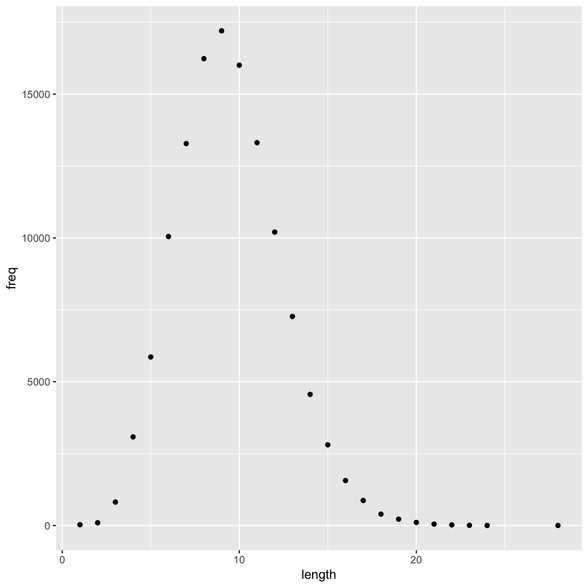

## R Markdown HTML report 



```{r load-data}
data <- read.delim('histogram.tsv')
```


```{r analyze-data}
most.common.length <- data$length[which.max(data$freq)]
```

The most common English word length is `r most.common.length`.


